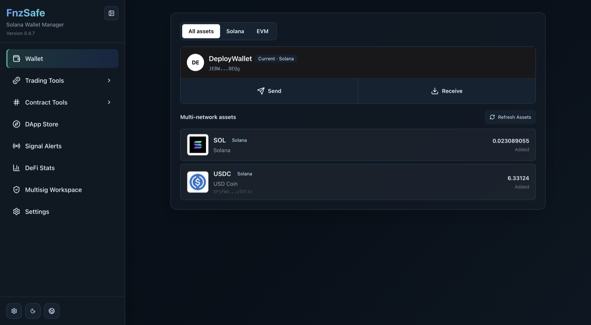
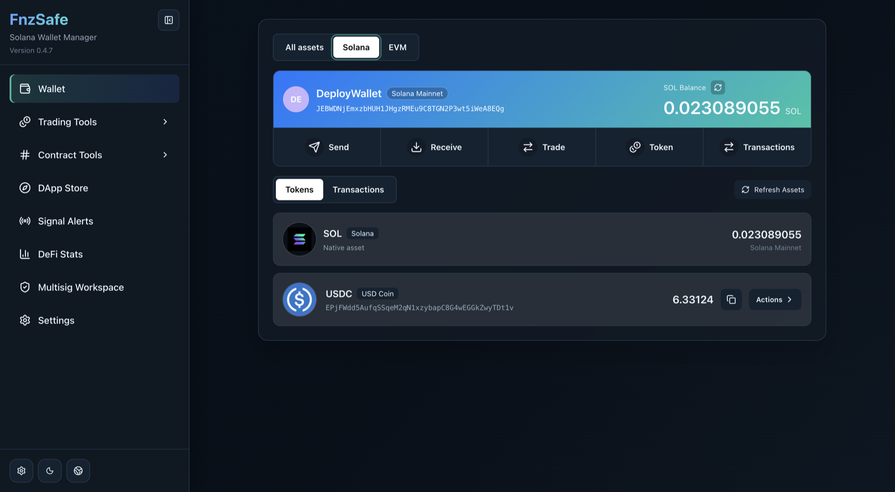
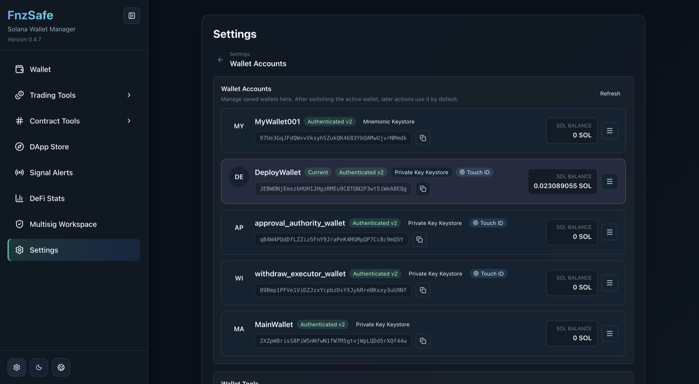
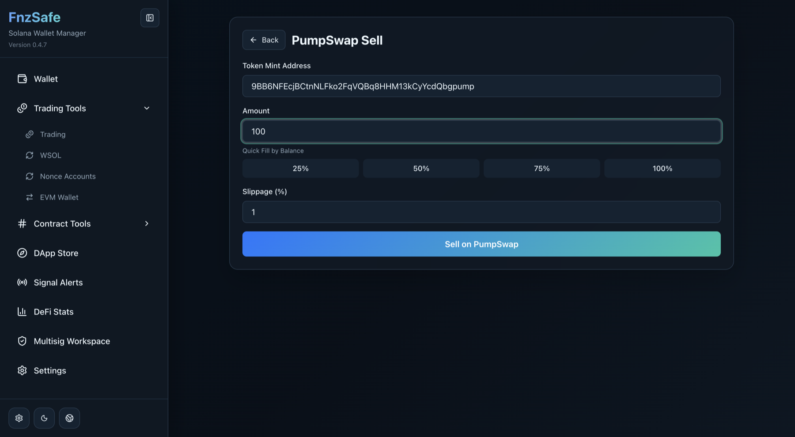
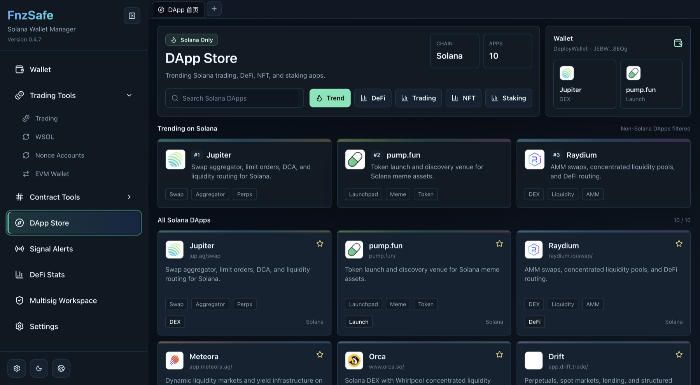
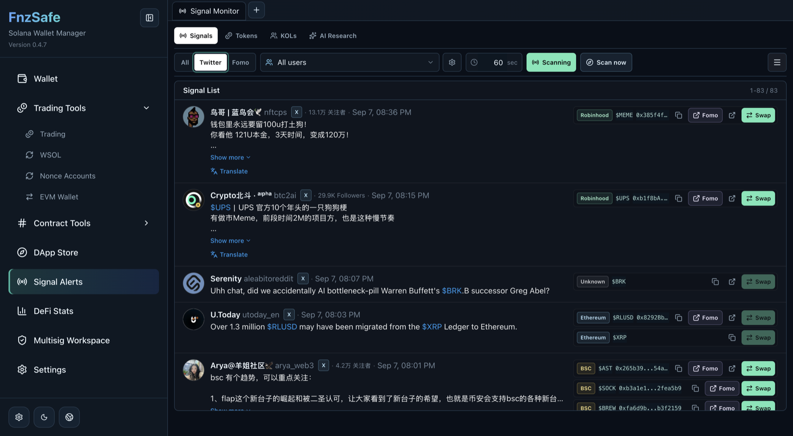
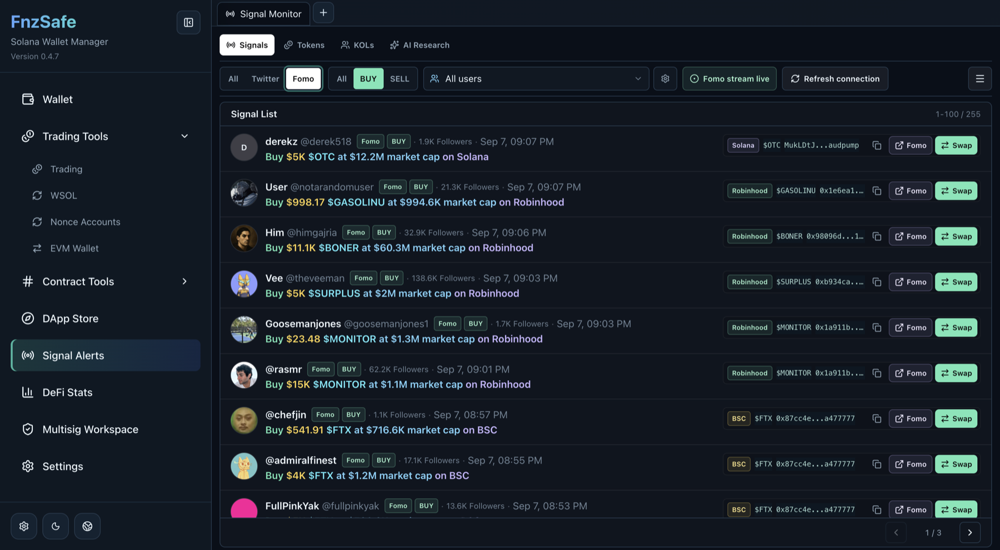
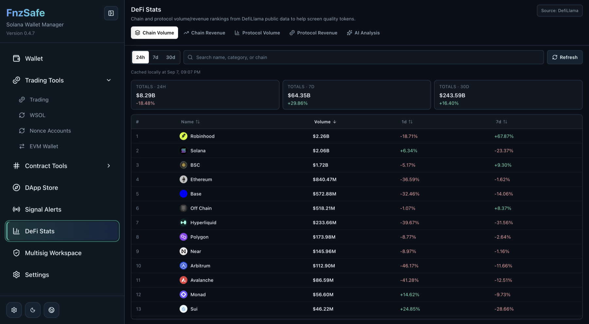
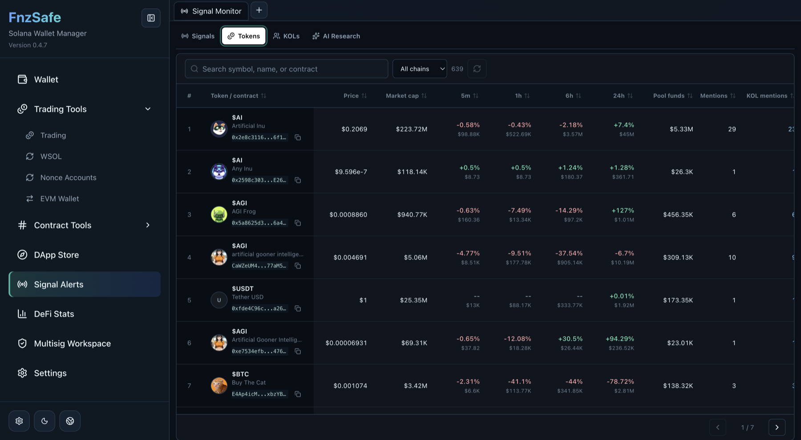

<div align="center">
  <h1>FnzSafe - Open-Source Multi-Chain Wallet</h1>
  <p><strong>A local-first, self-custody crypto wallet for desktop and mobile with secure key management, dApp signing, trading signals, DeFi research, and Squads multisig.</strong></p>
  <p>
    <a href="README_CN.md">中文</a> ·
    <a href="https://github.com/0xfnzero/FnzSafe/releases/latest">Download</a> ·
    <a href="https://fnzero.dev/">Website</a> ·
    <a href="https://t.me/fnzero_group">Telegram</a> ·
    <a href="https://discord.gg/ckf5UHxz">Discord</a>
  </p>
  <p>
    <a href="https://crates.io/crates/fnzero-safe-core"></a>
    <a href="https://docs.rs/fnzero-safe-core"></a>
    <a href="LICENSE"></a>
  </p>
</div>

FnzSafe is an open-source multi-chain wallet for Solana and EVM-compatible networks, with experimental Bitcoin and TRON account adapters. Bitcoin and TRON currently support account derivation and address validation, not transfers or broadcasting. It combines a Tauri desktop wallet, a Flutter mobile wallet, and a Rust wallet SDK/CLI. Private keys remain in encrypted local keystores while wallet operations, dApps, crypto signals, and market research share one working surface.

## Wallet Capabilities

| Area | Included capabilities |
|---|---|
| Wallet lifecycle | Create a universal mnemonic wallet, import a mnemonic/private key/Keystore, switch and rename accounts, export encrypted backups or private keys, change passwords, and remove local wallets |
| Solana wallet | SOL, SPL Token, and Token-2022 balances; token metadata; receive/send flows; token actions; transaction history; mainnet, devnet, testnet, and custom RPC endpoints |
| EVM wallet | One derived address across EVM networks; native and ERC-20 assets; EIP-1559 transfers; Etherscan V2 transaction history when configured; built-in networks and custom EVM RPC configuration |
| Bitcoin and TRON | Experimental BIP84/BIP44 account derivation and address validation through the shared Rust, desktop, and mobile chain APIs; transaction building and broadcasting are not enabled yet |
| dApp wallet | Built-in Solana dApp browser, provider injection, message/transaction signing, deep links, transaction previews, automatic chain selection, and revocable connected-app permissions |
| Wallet security | Argon2id + AES-256-GCM keystores, Touch ID/biometric confirmation, TOTP, Triple Wallet (3FA), auto-lock, sensitive-log filtering, and normal signing without returning decrypted private keys to the frontend |
| Shared operations | SOL/SPL/ERC-20 transfers, WSOL wrap/unwrap/close, durable nonce accounts, address book, Squads v4 multisig, and SOL/SPL payment proposals |
| Developer tools | Solana Program deploy/upgrade/build, generic function calls, external signing requests, deployment history, Rust SDK, CLI, local API, and bot integration |

## Trading, Signals, and DeFi

- **Chain-aware trading:** separate Fomo and Swap actions, prefilled token contracts, Jupiter routing on Solana, configured DEX routing on EVM chains, and Pump.fun/PumpSwap sell and cashback tools.
- **Twitter and Fomo signals:** browser-backed Twitter/X collection without the Twitter API, live Fomo BUY/SELL events, KOL filters, token resolution, translation, reconnect controls, background refresh, and SQLite caching.
- **Token intelligence:** chain, contract, price, market cap, liquidity, interval performance, mention counts, KOL counts, and direct Fomo/Swap actions.
- **DeFi analytics:** cached DefiLlama chain/protocol volume and revenue rankings with stale-while-revalidate loading.
- **AI research:** local evidence retrieval with configurable AI providers for signal and DeFi analysis; API keys stay in secure system storage.
- **Platforms:** macOS and Windows desktop packages, iOS and Android apps, and an interactive Rust CLI.

## Screenshots

All screenshots below are from the desktop client with locally loaded wallet and research data.

| Wallet assets | Solana wallet | Wallet accounts |
|---|---|---|
|  |  |  |
| Solana trading | DApp store | Twitter signals |
|  |  |  |
| Fomo stream | DeFi analytics | Token market |
|  |  |  |

## Requirements

- Rust 1.89+
- Node.js 22-24 and npm 10+
- macOS for macOS/iOS builds; Windows with MSVC build tools for Windows packages
- Flutter 3.24+, Xcode, or Android SDK/NDK/JDK 17 only when working on mobile

## Run

Desktop:

```bash
npm --prefix apps/desktop install
make dev
```

`make dev` starts the Tauri app, the Next.js UI on `127.0.0.1:3840`, and the local API on `127.0.0.1:3841`. Stop all local development processes with `make stop`.

Set `FNZERO_SAFE_ETHERSCAN_API_KEY` before startup to enable Etherscan V2 history on matching built-in EVM networks. Without a valid key, those chain descriptors do not advertise `transactions:history`.

Mobile:

```bash
cd apps/mobile
./tool/bootstrap_mobile.sh
flutter pub get
./tool/generate_bridge.sh
flutter run -d ios       # or an Android device ID
```

CLI:

```bash
cargo run -p fnzero-safe-core --features full -- start
```

## Package

Artifacts are copied into `release/<platform>/`.

```bash
make package-macos
make package-windows
make package-ios
make package-android
```

Use `make package` to build every platform supported by the current host. Signed iOS packages require an Apple developer configuration; Android release signing requires `apps/mobile/android/key.properties`; Windows packages should be built on Windows.

Public macOS packages must be signed with a `Developer ID Application` certificate and notarized by Apple; `Apple Development` and ad-hoc signatures are rejected by Gatekeeper. Set `APPLE_SIGNING_IDENTITY` and provide notarization credentials through either `APPLE_ID`, `APPLE_PASSWORD`, and `APPLE_TEAM_ID`, or `APPLE_API_KEY`, `APPLE_API_ISSUER`, and `APPLE_API_KEY_PATH`, before running `make package-macos`. The command checks the configuration before packaging and verifies the signature, stapled ticket, and Gatekeeper assessment afterwards. For a local-only unsigned build, run `cd apps/desktop && npm run desktop:build`; do not publish that artifact as a download.

## Verify

```bash
cargo fmt --all -- --check
cargo test --workspace
npm --prefix apps/desktop run test:unit
npm --prefix apps/desktop run lint
```

## Security

FnzSafe is local-first, but wallet software still carries real risk. Back up encrypted keystores, verify addresses and transaction previews, and never expose the desktop API port through a tunnel or public proxy. Market and signal data is informational, not financial advice.

## Documentation

- [Multi-chain architecture and support matrix](docs/multichain-architecture.md)
- [Mobile development](apps/mobile/README.md)
- [Mobile EVM notes](docs/mobile/evm-development.md)
- [AI plugin architecture](docs/ai-plugin-architecture.md)
- [Examples](examples/README.md)

## License

[MIT](LICENSE)
