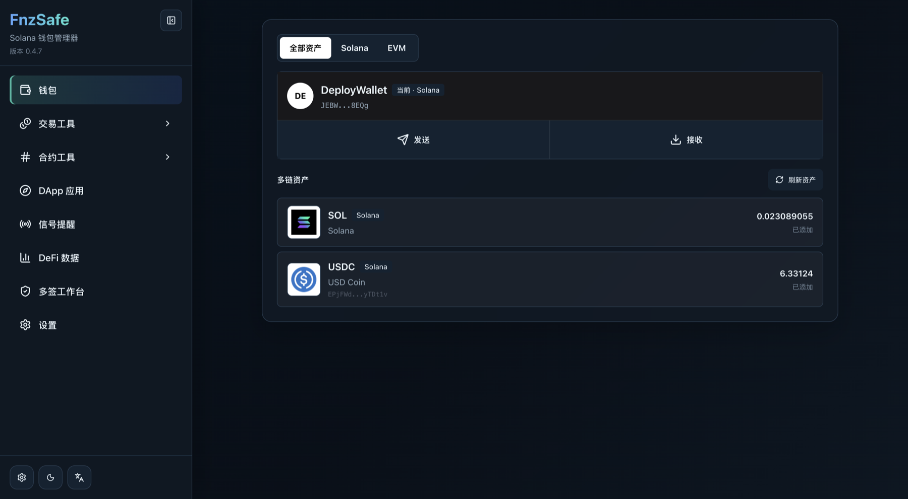
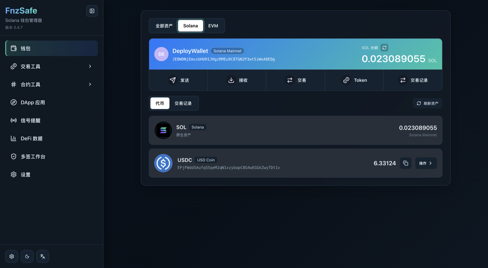
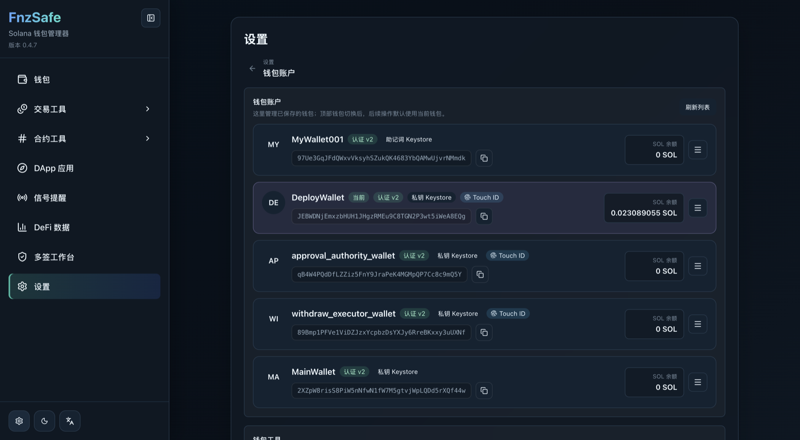
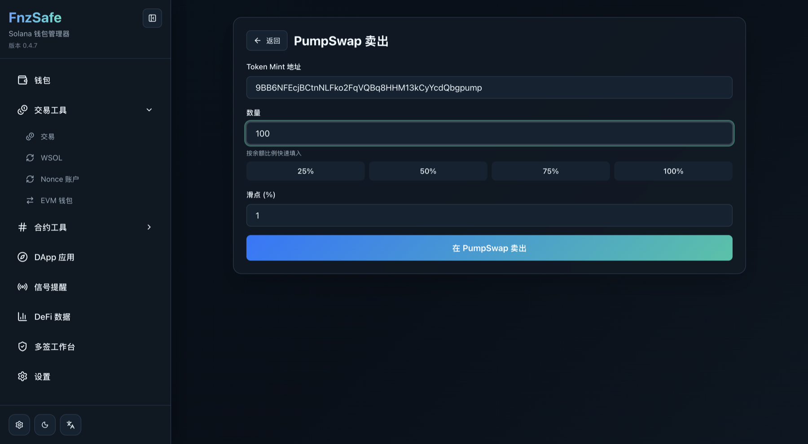
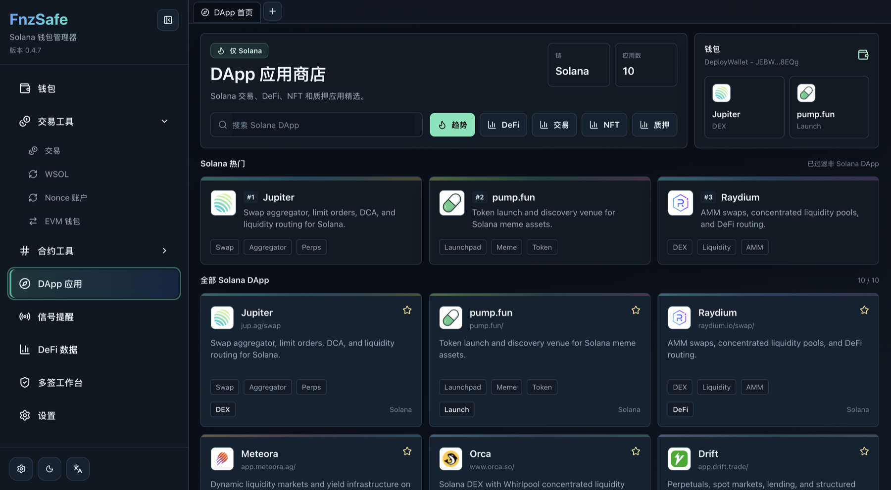
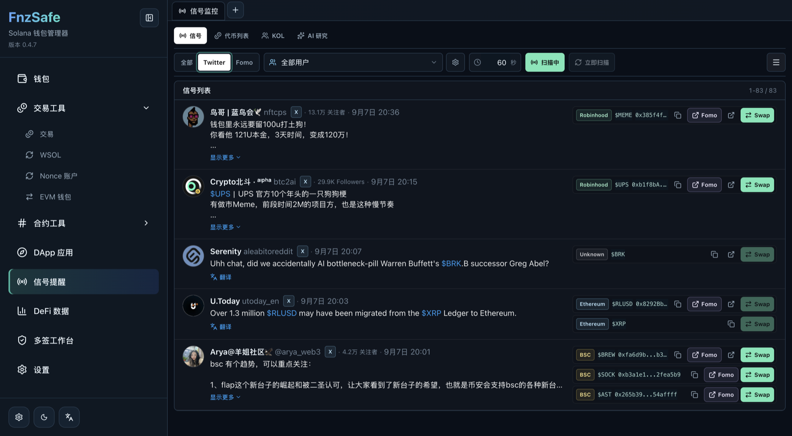
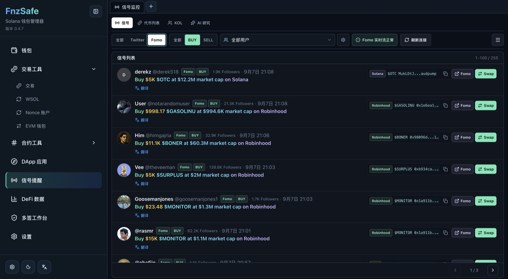
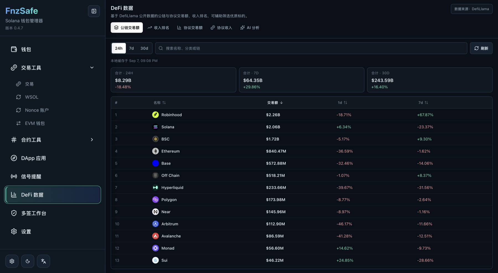
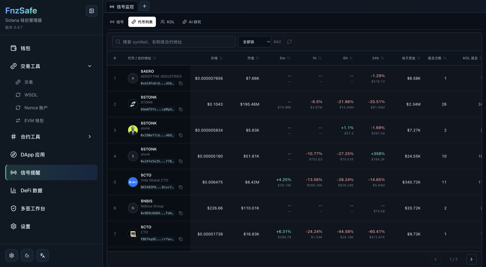

<div align="center">
  <h1>FnzSafe - 开源 Solana 与 EVM 多链钱包</h1>
  <p><strong>面向桌面端和移动端的本地优先、自托管加密钱包，覆盖安全密钥管理、DApp 签名、交易信号、DeFi 研究与 Squads 多签。</strong></p>
  <p>
    <a href="README.md">English</a> ·
    <a href="https://github.com/0xfnzero/FnzSafe/releases/latest">下载</a> ·
    <a href="https://fnzero.dev/">官网</a> ·
    <a href="https://t.me/fnzero_group">Telegram</a> ·
    <a href="https://discord.gg/ckf5UHxz">Discord</a>
  </p>
  <p>
    <a href="https://crates.io/crates/fnzero-safe-core"></a>
    <a href="https://docs.rs/fnzero-safe-core"></a>
    <a href="LICENSE"></a>
  </p>
</div>

FnzSafe 是一个开源多链钱包，支持 Solana、Ethereum、BNB Smart Chain（BSC）、Base、Arbitrum、Optimism、Polygon、Avalanche、Robinhood Chain 及其他 EVM 兼容网络。项目由 Tauri 桌面钱包、Flutter 移动钱包和 Rust 钱包 SDK/CLI 组成；私钥保存在本地加密 Keystore 中，钱包操作、DApp、加密货币信号和市场研究集中在同一个工作界面内。

## 钱包能力

| 方向 | 已支持能力 |
|---|---|
| 钱包生命周期 | 创建通用助记词钱包，导入助记词/私钥/Keystore，切换和重命名账户，导出加密备份或私钥，修改密码，以及删除本地钱包 |
| Solana 钱包 | SOL、SPL Token、Token-2022 余额和元数据，收款/转账、代币操作、交易记录，以及 mainnet、devnet、testnet 和自定义 RPC |
| EVM 钱包 | 一个派生地址用于全部 EVM 网络，原生资产与 ERC-20 资产、EIP-1559 转账、交易记录、内置网络和自定义 EVM RPC |
| DApp 钱包 | 内置 Solana DApp 浏览器、Provider 注入、消息/交易签名、Deep Link、交易预览、自动切换公链，以及可撤销的 DApp 授权 |
| 钱包安全 | Argon2id + AES-256-GCM Keystore、Touch ID/生物识别、TOTP、三重保护钱包（3FA）、自动锁定、敏感日志过滤，日常签名不会把解密后的私钥返回前端 |
| 通用操作 | SOL/SPL/ERC-20 转账，WSOL wrap/unwrap/关闭账户，Durable Nonce、地址簿、Squads v4 多签和 SOL/SPL 支付提案 |
| 开发者工具 | Solana Program 部署/升级/构建、通用函数调用、外部签名请求、部署历史、Rust SDK、CLI、本地 API 与 Bot 集成 |

## 交易、信号与 DeFi

- **按链交易：** Fomo 与 Swap 独立入口，自动填充代币合约，Solana 使用 Jupiter，EVM 链使用对应 DEX，并支持 Pump.fun/PumpSwap 卖出和返现。
- **Twitter 与 Fomo 信号：** 无需 Twitter API 的浏览器采集、Fomo BUY/SELL 实时事件、KOL 过滤、代币解析、翻译、断线重连、后台刷新与 SQLite 缓存。
- **代币情报：** 聚合链、合约、价格、市值、流动性、各周期涨跌、提及次数和 KOL 提及，并可直接打开 Fomo/Swap。
- **DeFi 数据：** 缓存 DefiLlama 链/协议交易量和收入排名，进入页面先显示历史数据，再后台异步刷新。
- **AI 研究：** 基于本地证据检索分析信号和 DeFi，支持配置 AI 提供商，API Key 保存在系统安全存储中。
- **多平台：** macOS、Windows 桌面端，iOS、Android 移动端，以及交互式 Rust CLI。

## 产品截图

以下截图均来自桌面客户端，并加载了本地钱包和研究数据。

| 钱包资产 | Solana 钱包 | 钱包账户 |
|---|---|---|
|  |  |  |
| Solana 交易 | DApp 应用商店 | Twitter 信号 |
|  |  |  |
| Fomo 数据流 | DeFi 数据 | 代币行情 |
|  |  |  |

## 环境要求

- Rust 1.89+
- Node.js 22-24、npm 10+
- 构建 macOS/iOS 需要 macOS；构建 Windows 安装包需要 Windows 与 MSVC build tools
- 仅移动端开发需要 Flutter 3.24+、Xcode 或 Android SDK/NDK/JDK 17

## 运行

桌面端：

```bash
npm --prefix apps/desktop install
make dev
```

`make dev` 会启动 Tauri 客户端、`127.0.0.1:3840` 上的 Next.js UI，以及 `127.0.0.1:3841` 上的本地 API。使用 `make stop` 停止全部本地开发进程。

移动端：

```bash
cd apps/mobile
./tool/bootstrap_mobile.sh
flutter pub get
./tool/generate_bridge.sh
flutter run -d ios       # 或 Android 设备 ID
```

CLI：

```bash
cargo run -p fnzero-safe-core --features full -- start
```

## 打包

产物会复制到 `release/<platform>/`。

```bash
make package-macos
make package-windows
make package-ios
make package-android
```

`make package` 会构建当前主机支持的全部平台。签名 iOS 包需要 Apple Developer 配置；Android 正式签名需要 `apps/mobile/android/key.properties`；Windows 安装包建议在 Windows 上构建。

## 验证

```bash
cargo fmt --all -- --check
cargo test --workspace
npm --prefix apps/desktop run test:unit
npm --prefix apps/desktop run lint
```

## 安全说明

FnzSafe 采用本地优先架构，但钱包软件仍有真实资金风险。请备份加密 Keystore，逐项核对地址和交易预览，切勿通过隧道或公共代理暴露桌面 API 端口。行情和信号数据仅供参考，不构成投资建议。

## 文档

- [移动端开发](apps/mobile/README.md)
- [移动端 EVM 说明](docs/mobile/evm-development.md)
- [AI 插件架构](docs/ai-plugin-architecture.md)
- [示例](examples/README.md)

## 许可证

[MIT](LICENSE)
